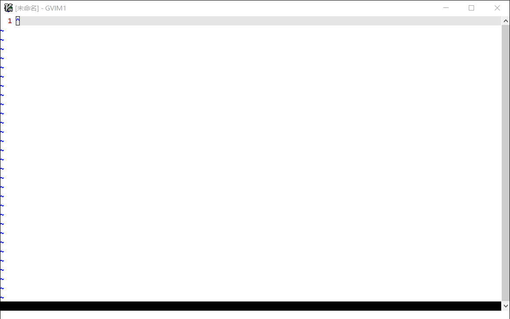

The StackView
=============

Introduction
------------

The Stackview is the GDB stack information viewer of vim editor. Using this plugin, users can intuitively browse the complex function call relationship and quickly open the file for reading or editing.



Installation
------------

Below are just some of the method for installing StackView. Do not follow all of these instructions; just pick your favorite one. Other plugin managers exist, and StackView should install just fine with any of them.

#### General way:
Get the StackView ready and unpack the package.

```bash
cd ~/.vim/plugin
git clone https://github.com/silent-dxx/stackview.git
```
#### [Vundle.vim](https://github.com/VundleVim/Vundle.vim)
```vim
call vundle#begin()
Plugin 'silent-dxx/stackview'
call vundle#end()
```

#### [vim-plug](https://github.com/junegunn/vim-plug)
```vim
call plug#begin()
Plug 'silent-dxx/stackview'
call plug#end()
```
F.A.Q.
------
#### How to use stackview?
1) First you need to get the GDB stack information you want to see. 
- Get the stack using GDB's MI interface:
```bash
gdb -q -i mi2 for-your-program

# View stack information command
-stack-list-frames
```
- Using eclipse + GDB to get stack information
In the **console** window of eclipse, select **gdb traces**

2) Write configuration file(*.bkpt), the format is as follows:
```python
# Source file path mapping
file_mapping = {
    '/orig_path1': '/conv_path1',
    '/orig_path2': '/conv_path2'
}

# Fill in the GDB call stack information here
stack_list.append('''
^done,stack=[frame={level="0",addr="0x000000aaaab1e4f0",func="dix_main",file="main.c",fullname="/home/loongson/rpmbuild/BUILD/xorg-server-1.20.1/dix/main.c",line="276"},frame={level="1",addr="0x000000aaaab029a0",func="main",file="stubmain.c",fullname="/home/loongson/rpmbuild/BUILD/xorg-server-1.20.1/dix/stubmain.c",line="34"}]
''')

# You can continue to fill in multiple groups of information
stack_list.append('''
......
''')
```
3) Using stackview to open the configuration file:

```vim
:StackView ~/demo.bkpt
```
